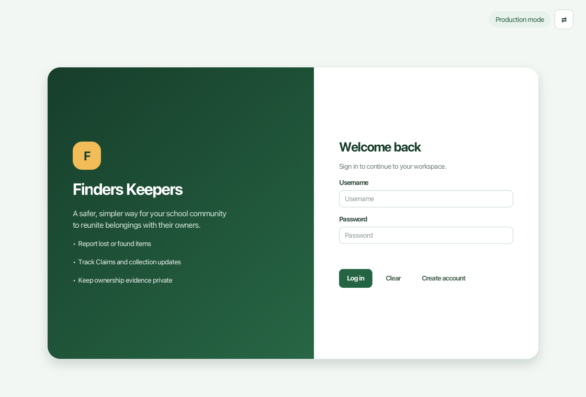

# Finders Keepers

Finders Keepers is a JavaFX desktop lost-and-found application for primary schools. Students can report lost or found belongings, submit ownership Claims, and book approved collections. Desk Officers can review reports, link possible matches, decide Claims, and manage the item collection and return process.



This project is developed for NUS CS3227 MP2 using Java SE 25.

## Development commands

```bash
./gradlew run
./gradlew clean check
./gradlew release
```

See [docs/UserGuide.md](docs/UserGuide.md) for user instructions.

See [docs/DeveloperGuide.md](docs/DeveloperGuide.md) for developer documentation.
