# Finders Keepers User Guide

Finders Keepers helps Students report lost or found belongings and helps Desk Officers return an item safely to the right person. This guide uses only synthetic examples.

## Table of contents

1. [Welcome to Finders Keepers](#1-welcome-to-finders-keepers)
2. [Quick start](#2-quick-start)
3. [Understand the main workflow](#3-understand-the-main-workflow)
4. [Student features](#4-student-features)
5. [Desk Officer features](#5-desk-officer-features)
6. [Complete sample workflow](#6-complete-sample-workflow)
7. [Frequently asked questions](#7-frequently-asked-questions)
8. [Troubleshooting](#8-troubleshooting)
9. [Glossary](#9-glossary)

## 1. Welcome to Finders Keepers

The app has two roles:

- A **Student** reports a lost or found item, reviews possible matches, submits an ownership Claim, and books collection after approval.
- A **Desk Officer** reviews reports, links possible matches, decides Claims, creates collection slots, and records the item handover.

The app deliberately separates a *possible match* from an *approved Claim*. Matching details may suggest that two reports describe the same item, but a Desk Officer must still review the Student's evidence before approving return.

### How to read the screenshots

A red outline and number mark the next control to choose. The example names, accounts, Claim references, dates, and item descriptions are synthetic.

## 2. Quick start

### System requirements

- Windows, macOS, or Linux
- Java 25
- Enough writable disk space for the application and its local `data` folder

Check Java from a terminal:

```bash
java --version
```

### Run from the project

From the `Xcode` project folder:

```bash
./gradlew run
```

On Windows, use:

```text
gradlew.bat run
```

### Run the packaged application

Build the release:

```bash
./gradlew release
```

Then run:

```bash
java -jar release/FindersKeepers.jar
```

Run the JAR from a writable working directory because the application reads and writes mutable local data under that directory's `data` folder. The two read-only demo accounts are bundled inside the JAR and remain available regardless of the launch directory.

### Log in

The login page starts in **Production mode**. You can:

- enter an existing local username and password;
- choose **Create account** to register a Student or Desk Officer account; or
- switch to **Demo mode** and choose a synthetic role without typing a password.

The application bundles these public test accounts, so Demo mode works without an external account file:

| Role | Username | Password |
|---|---|---|
| Student | `demo.student` | `Student-Demo-27!` |
| Desk Officer | `demo.officer` | `Officer-Demo-42!` |

Do not reuse these public passwords for a real account.

## 3. Understand the main workflow

The normal route from a report to a completed return is:

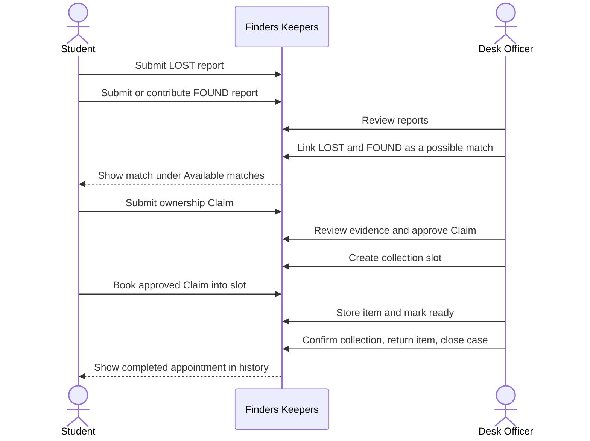

Important rules:

- Linking reports does not approve ownership.
- A Student can Claim only a Desk Officer-linked match for their own LOST report.
- After any Student submits an active Claim for a found item, competing Students no longer see that found item under **Available matches**.
- Only an `APPROVED` Claim can be booked for collection.
- Appointment times are shown in Singapore time.

## 4. Student features

### 4.1 Report a lost or found item

1. Log in as a Student.
2. Open **Report an item**.
3. Choose **Lost** or **Found**.
4. Enter the item name, category, location, and date.
5. Write a public description that is safe for other users to see.
6. Add one private identifying detail that can help a Desk Officer verify the owner. Do not put that secret in the public description.

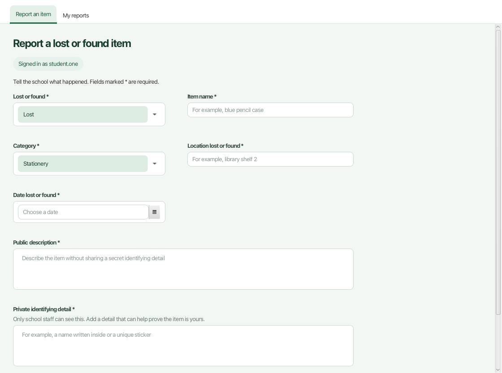

7. Review the details, then choose **Submit report**.

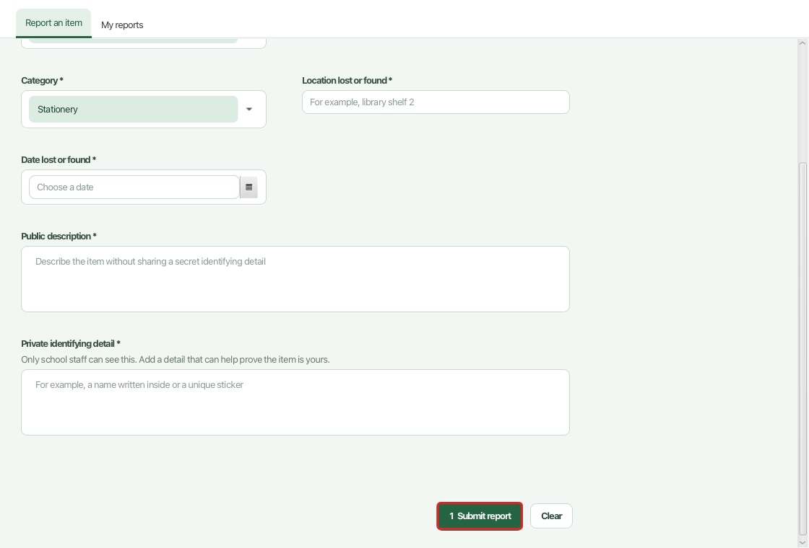

The success message appears only after the report is saved. Use **My reports** to view your reports newest first or search by item name and public description.

### 4.2 Submit an ownership Claim

You cannot create a Claim until a Desk Officer links a LOST report you own to a FOUND report.

1. Open **Claims**, then **Available matches**.
2. Find the card grouped under your lost item.
3. Choose **Claim this found item**.

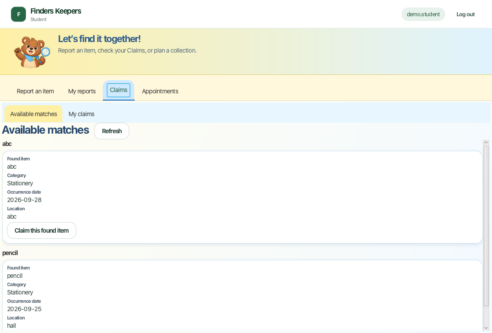

4. Enter ownership evidence that is useful to a Desk Officer but not obvious from the public description.
5. Choose **Review claim**, check the summary, then confirm submission.
6. Open **My claims** to see `PENDING_REVIEW`, `APPROVED`, `REJECTED`, or `WITHDRAWN`.

#### What happens when more than one Student has a possible match?

Several LOST reports can initially be linked to one FOUND report. As soon as one Student submits a Claim, the shared found item is locked while that Claim is active. Other Students see no card for it, so they cannot submit a competing Claim from stale information.

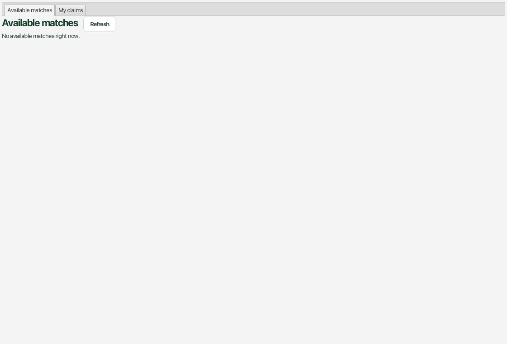

Choose **Refresh** after another user acts. The automated test suite also checks this two-Student rule directly.

### 4.3 Book an approved Claim

1. Wait until **My claims** shows `APPROVED`.
2. Open **Appointments**.
3. Select the approved Claim.
4. Select an available collection slot.
5. Choose **Book selected slot**.

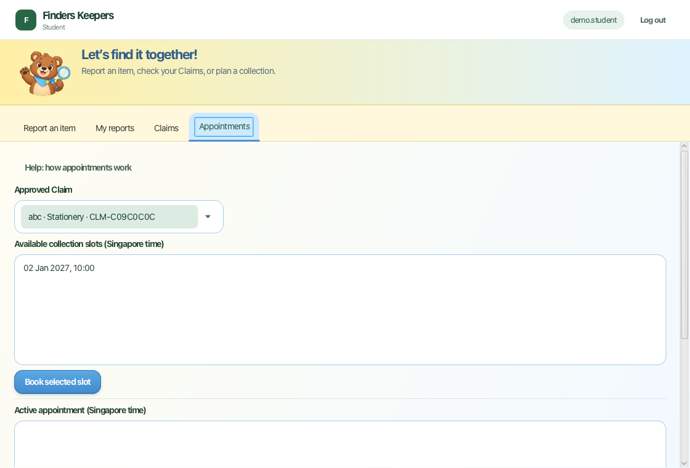

A successful booking appears under **Active appointment** with `BOOKED` and a Singapore date and time. Before the slot starts, you may select the active appointment and either:

- choose **Cancel active appointment**; or
- select another available slot and choose **Reschedule to selected slot**.

Past attempts remain in **Appointment history**. Students never see the officer-only storage location or officer account details.

### 4.4 Use appointment help

At the top of **Appointments**, choose **Help: how appointments work**. The help page explains approval, booking, attendance, and checking the result in plain language.

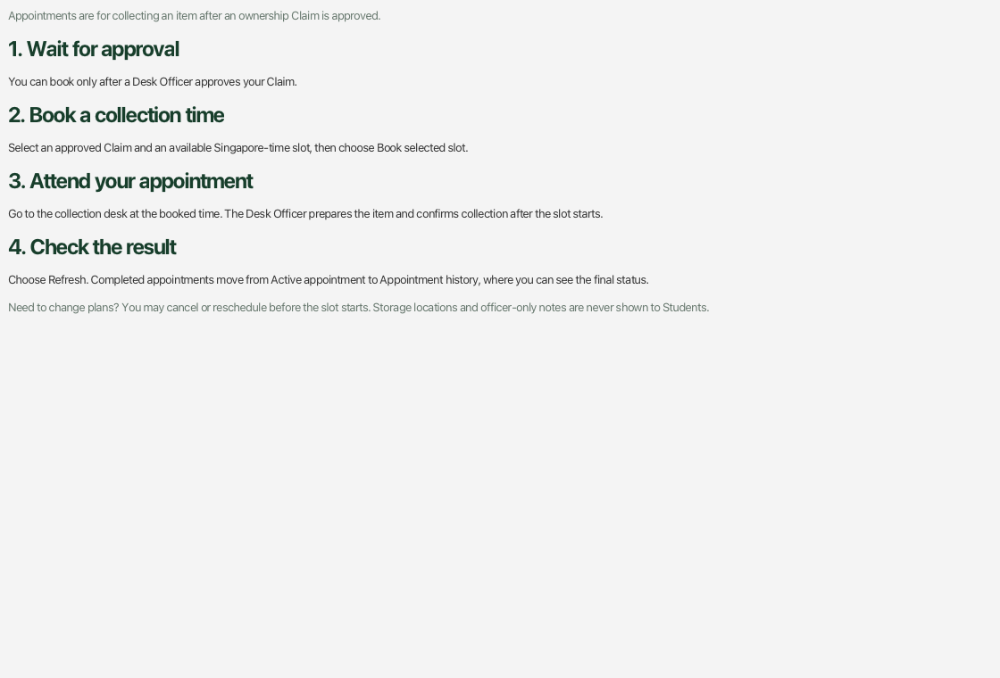

## 5. Desk Officer features

### 5.1 Review reports

Open **Report review**. Select a report to see its full details. This page is read-only: selecting a report does not change its status. Reports that belong to an approved Claim are removed from the active review queue.

### 5.2 Link possible matches

1. Open **Possible matches**.
2. Select a suggestion from the left.
3. Compare the LOST and FOUND reports on the right. Rule points explain why the pair was suggested; they are not proof of ownership.
4. Choose **Link as Possible Match**.

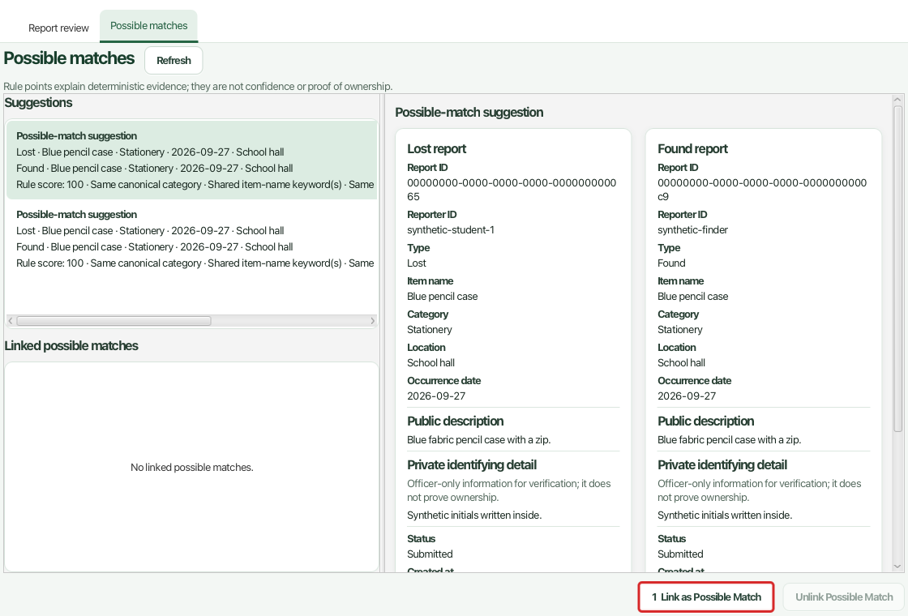

The pair moves to **Linked possible matches** and becomes available to the eligible Student. **Unlink Possible Match** removes only the relationship; it does not delete either report.

### 5.3 Approve a Claim

1. Open **Claims**, then **Pending review**.
2. Select the oldest pending Claim.
3. Compare the ownership evidence with both complete reports.
4. Enter an optional approval reason, if useful.
5. Choose **Approve** and confirm the decision.

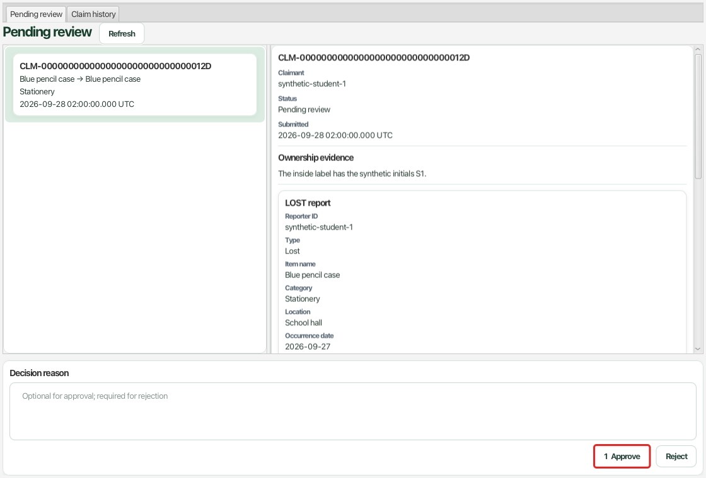

Use **Reject** only when the Claim should not proceed. A rejection reason is required. Approval and rejection are terminal decisions, so review carefully before confirming.

### 5.4 Create a collection slot

1. Open **Appointments**.
2. Choose the **+** button beside **Collection slots (Singapore time)**.

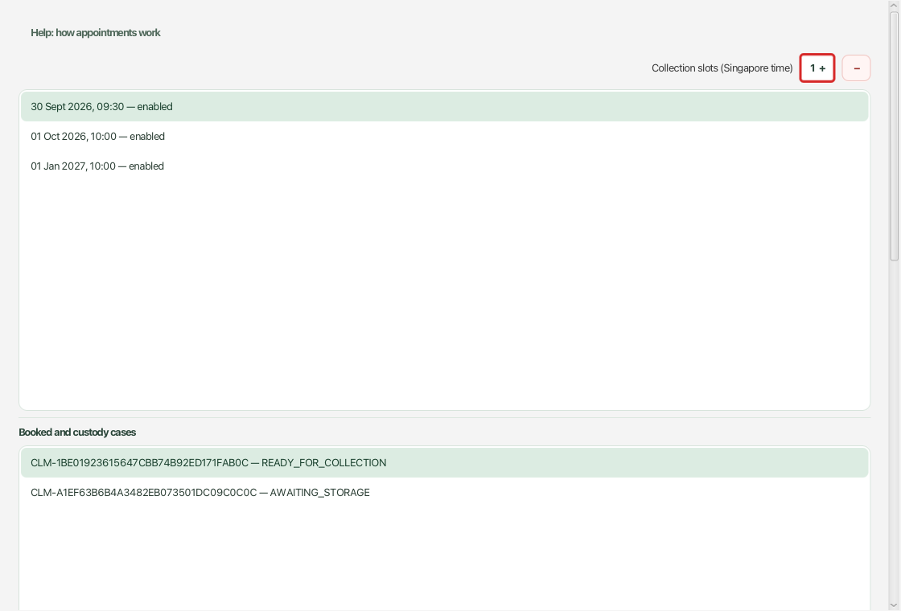

3. Choose a future Singapore date and hour.
4. Choose `00` or `30` minutes.
5. Choose **Add slot**.
6. Confirm that the new 30-minute slot appears as `enabled`.

Use **−** to disable an unbooked future slot. A booked, started, or past slot cannot be silently removed.

### 5.5 Prepare and return an item

A case appears under **Booked and custody cases** only after a Student books.

1. Select the case.
2. Enter a synthetic storage location such as `Locker A1`.
3. Choose **Record storage location**.

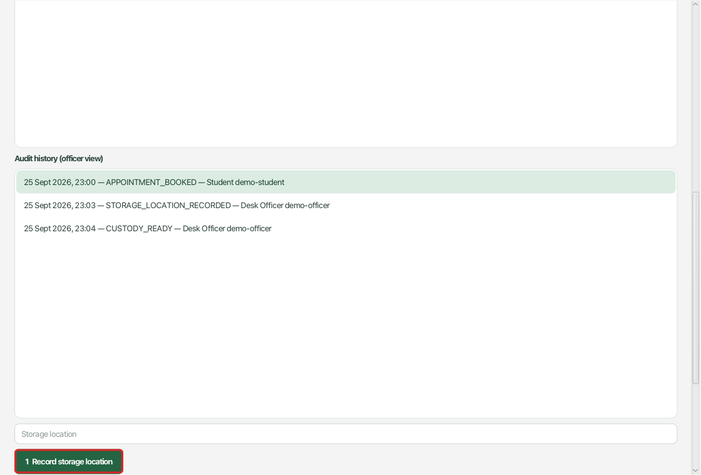

4. Choose **Mark ready for collection**. Custody becomes `READY_FOR_COLLECTION`.
5. At or after the slot start, choose **Confirm collection**. Before the start, the app returns `TOO_EARLY` and makes no change.
6. Choose **Mark item returned**.
7. Choose **Close case**. The case ends as `CLOSED`.

The action buttons appear only when relevant. If a button is not shown, finish the preceding step and refresh. The selected case's audit history records the booking and each custody, collection, return, and closure action with the actor role.

Use **Record NO_SHOW** only after an unattended slot has ended. It releases the slot and lets the Student book again; it is not part of a successful return.

## 6. Complete sample workflow

Use future times far enough ahead to complete the role changes.

1. **Students report items.** Student One submits a LOST report. A Student submits the corresponding FOUND report. If testing competition, Student Two submits another LOST report for the same item.
2. **Desk Officer links reports.** In **Possible matches**, link each qualifying LOST report to the FOUND report.
3. **Student One submits a Claim.** In **Available matches**, submit ownership evidence. Log in as Student Two and refresh: the shared found item must no longer appear.
4. **Desk Officer approves.** In **Claims**, select the pending Claim and choose **Approve**.
5. **Desk Officer creates a slot.** In **Appointments**, choose **+**, add a future half-hour Singapore-time slot, and confirm it is enabled.
6. **Student books.** Select the approved Claim and slot, choose **Book selected slot**, and confirm a `BOOKED` row.
7. **Desk Officer prepares the item.** Refresh **Appointments**, select the new case, record `Locker A1`, then mark it ready.
8. **Desk Officer confirms collection.** At or after the slot starts, confirm collection, mark the item returned, and close the case, in that order.
9. **Student verifies the result.** Refresh **Appointments**. The booking is no longer active; history shows the scheduled time, `COLLECTION_CONFIRMED`, and the closed case.

## 7. Frequently asked questions

### Why can I not see a found item under Available matches?

It may not be linked to your LOST report, it may already be locked by an active Claim, or an approved Claim may have closed the item. Choose **Refresh** first.

### Why can I not book an appointment?

The Claim must belong to the signed-in Student and currently be `APPROVED`. Select both a Claim and an enabled future slot.

### Why is a booked case missing from the Desk Officer page?

Choose **Refresh**. Cases appear only after the Student's booking is committed.

### Why can I not confirm collection?

The item must have a storage location, be marked ready, and have reached the slot start. The pop-up explains which condition is missing.

### Where is my data stored?

The app stores local JSON and relationship files under `data`. These files can contain private descriptions, ownership evidence, storage locations, and account information. Do not share them as sample data.

## 8. Troubleshooting

- **Java or Gradle does not start:** confirm that `java --version` reports Java 25 and run the wrapper from the `Xcode` project folder.
- **Local accounts are unavailable:** do not replace the credential store. Ask the project team to inspect or restore it.
- **Reports, Claims, or appointments are unavailable:** stop making changes and ask the project team to inspect the relevant store. The app fails closed rather than overwriting unreadable data.
- **A list looks out of date:** choose **Refresh**. Commands recheck the stored state before committing, so a stale screen cannot bypass workflow rules.
- **The release JAR is missing:** run `./gradlew release` and check `release/FindersKeepers.jar`.

## 9. Glossary

| Term | Meaning |
|---|---|
| Report | A Student's record of a lost or found item. |
| Possible match | A Desk Officer-created link between one LOST and one FOUND report. |
| Claim | A Student's ownership assertion for a linked found item. |
| Approved Claim | A Claim a Desk Officer accepted after reviewing evidence. |
| Collection slot | One enabled 30-minute Singapore-time period at the collection desk. |
| Collection case | The appointment, custody, and return record for one approved Claim. |
| Custody | The officer-side state describing storage, readiness, and return. |
| Audit history | The append-only record of appointment and custody actions. |

## Acknowledgements

Finders Keepers uses Java, JavaFX, Gradle, JUnit 5, Checkstyle, and JaCoCo. The guide structure was informed by the supplied sample user guide; all Finders Keepers instructions and screenshots describe this project.
